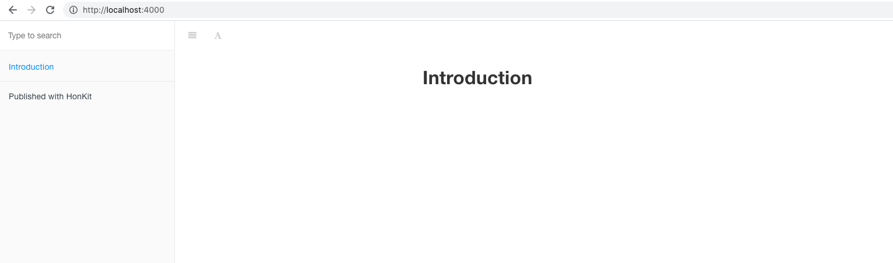
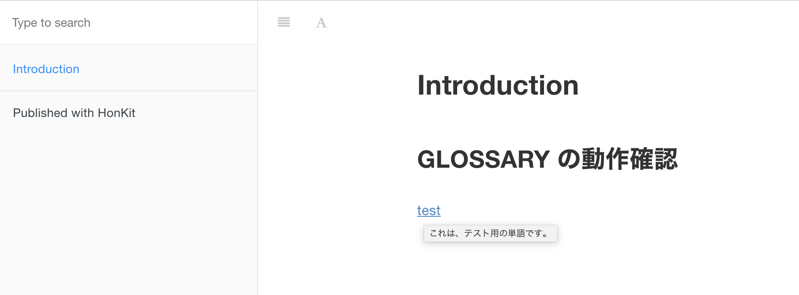
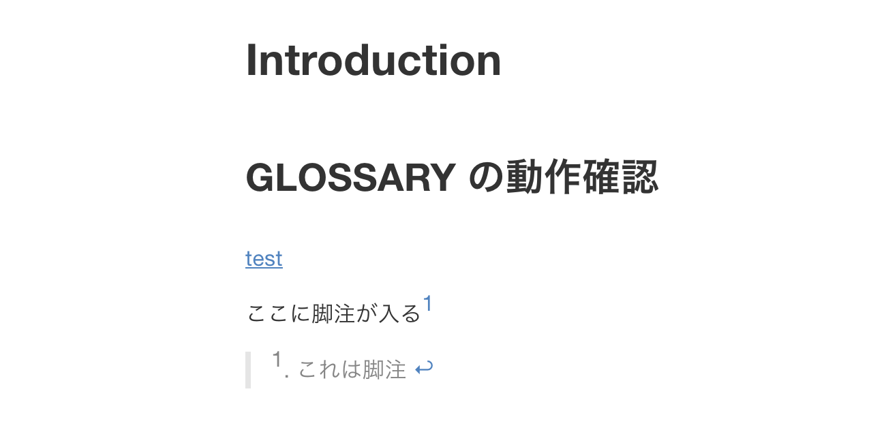
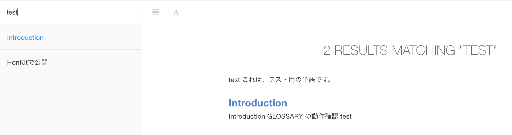

## Honkit とは

Honkitは、旧GitBookをForkして開発されたソフトウェアです。何ができるかといえば、MarkdownやAsciiDocなどの文書を本のような形式なHTMLとして出力したりすることができます。

## とりあえず使ってみる

[公式サイト](https://github.com/honkit/honkit)のQuick Start に習ってやってみる。まずは作業用のディレクトリを作成しておく。今回は、`honkit_template`というディレクトリをルートとして扱い、`src/` ディレクトリの中に実際のマークダウンファイルなどを格納していく。

```sh
$ mkdir honkit_template && cd honkit_template
$ mkdir src
```

次に、`npm` を使ってプロジェクトの初期化やHonkitのインストールを行う。公式サイト的に、ローカルに入れるのを推奨しているのでそうする。

```sh
$ npm init --yes
Wrote to /Users/chihiro/Desktop/honkit_template/package.json:

{
  "name": "honkit_template",
  "version": "1.0.0",
  "description": "",
  "main": "index.js",
  "scripts": {
    "test": "echo \"Error: no test specified\" && exit 1"
  },
  "keywords": [],
  "author": "",
  "license": "ISC"
}
$ npm install honkit --save-dev
npm WARN deprecated request@2.88.2: request has been deprecated, see https://github.com/request/request/issues/3142
npm WARN deprecated har-validator@5.1.5: this library is no longer supported
npm WARN deprecated uuid@3.4.0: Please upgrade  to version 7 or higher.  Older versions may use Math.random() in certain circumstances, which is known to be problematic.  See https://v8.dev/blog/math-random for details.
npm notice created a lockfile as package-lock.json. You should commit this file.
npm WARN honkit_template@1.0.0 No description
npm WARN honkit_template@1.0.0 No repository field.

+ honkit@3.6.21
added 320 packages from 347 contributors and audited 320 packages in 31.833s

19 packages are looking for funding
  run `npm fund` for details

found 0 vulnerabilities
$ npx honkit --version
3.6.21
```

インストールが完了したら、Honkitによる初期化とホットリロード可能な簡易HTTPサーバでの動作確認をしていく。今回実際のマークダウンなどは、`src/`にあるため引数にてそれを設定している。

```sh
$ npx honkit init ./src
warn: no summary file in this book
info: create README.md
info: create SUMMARY.md
info: initialization is finished
$ npx honkit serve ./src
Live reload server started on port: 35729
Press CTRL+C to quit ...

Starting server ...
info: 6 plugins are installed
info: 6 explicitly listed
info: plugin "livereload" is loaded
info: plugin "highlight" is loaded
info: plugin "search" is loaded
info: plugin "lunr" is loaded
info: plugin "fontsettings" is loaded
info: plugin "theme-default" is loaded
info: found 1 pages
info: found 0 asset files
info: >> generation finished with success in 0.3s !
Serving book on http://localhost:4000
```

Webブラウザなどで、`http://localhost:4000` にアクセスしてみると初期コンテンツとしては以下のような画面が現れる。



## カスタマイズしてみる

これだけだと味気ないので少し内部を見たりいじっていく。まずはディレクトリ構造。

```sh
$ ls src/
README.md   SUMMARY.md
```

`src/` ディレクトリの下には、2つのファイルが存在する。それぞれの中身は以下の通り。

```sh
$ cat src/README.md
# Introduction

$ cat src/SUMMARY.md
# Summary

* [Introduction](README.md)
```

先程のスクリーンショットと見比べてみるとわかるが、`SUMMARY.md` がサイドバーの目次に使われており、`README.md` が記事の中身に利用される。目次を増やしていきたい場合は、`SUMMARY.md`をいじって、リンクするファイルの記載を増やしていけば良いことがわかった。  
この他にも、`GLOSSARY.md` という用語定義などをする機能も備わっている。`src/GLOSSARY.md`の作成と`src/README.md`を書き換えてみる。

```sh
$ cat src/GLOSSARY.md
## test

これは、テスト用の単語です。
```

この状態で、再度アクセスして、testという単語にカーソルをあわせてみると下記のような表示に変わり、用語の定義が表示される。また、クリックすることで、`GLOSSARY.html`に飛ぶことができる。技術文書書く際にありがちな言葉の定義をしっかり定めてすぐ参照できるので非常にいい。



次に、Honkitの設定ファイルである`book.json` を作成してカスタマイズしてみる。下記のような内容のファイルを作成する。このファイル自体は、`src/`と同じ階層に配置する。

```sh
$ cat book.json
{
    "root": "./src",
    "title": "Honkit Template",
    "description": "新規に作成するときに流用するHonkit のテンプレート",
    "author": "Chihiro Hasegawa",
    "language": "ja"
}
```

記載された値で理解が難しいと思われるものは無いので説明は割愛する、今回このファイルで、Honkitのルートを指定しているため、`npx honkit` する際には、下記のように引数を追加することなく実行することができるようになる。

```
$ npx honkit serve
Live reload server started on port: 35729
Press CTRL+C to quit ...

Starting server ...
info: 6 plugins are installed
info: 6 explicitly listed
info: plugin "livereload" is loaded
info: plugin "highlight" is loaded
info: plugin "search" is loaded
info: plugin "lunr" is loaded
info: plugin "fontsettings" is loaded
info: plugin "theme-default" is loaded
info: found 2 pages
info: found 0 asset files
info: >> generation finished with success in 0.3s !
Serving book on http://localhost:4000
```

その他、詳細なパラメータなどは[公式サイト](https://honkit.netlify.app/config.html)を参照しよう。

## 本番利用するために

ここまでは、`npx honkit serve`コマンドにて簡易HTTPサーバを起動していた。しかしながら、実際に本番環境などにデプロイする際は、純粋なHTMLやCSS、JavaScriptが格納されたディレクトリだけで十分だ。それのために、`npx honkit build` コマンドを使うことで実際のHTMLなどを吐くことができるようになっている。

```sh
npx honkit build
info: 5 plugins are installed
info: 5 explicitly listed
info: plugin "highlight" is loaded
info: plugin "search" is loaded
info: plugin "lunr" is loaded
info: plugin "fontsettings" is loaded
info: plugin "theme-default" is loaded
info: found 2 pages
info: found 1 asset files
info: >> generation finished with success in 0.4s !
ls _book/
GLOSSARY.html      gitbook/           index.html         search_index.json
```

本コマンドでビルドをすると、`_book`というディレクトリで中身が作成される。GitHub Pagesなどにデプロイしたい場合に、`docs/`ディレクトリなどにHTML郡を出力したいするには、下記のように出力先を指定する必要があるのだが、位置引数なため、ソースディレクトリを指定する必要がありそうだ。`book.json` とかで、設定できないように見える。いいやり方があったら教えてほしい。

```sh
$ mkdir docs
$ npx honkit src docs
```

また、Honkit では`SUMMARY.md`に記載されていないファイルは全部コピーされてしまう(ビルド時などだと思われる)ようで、不要なファイルがある場合は、`.bookignore` ファイルを用意すると良いらしい。例えば、`package.json` や`package-lock.json` は不要なので、除外するには下記のように記載すれば良い。

```sh
$ cat .bookignore
package.json
package-lock.json
```

Honkit は、`.gitignore`**も**見てくれるそうなので、Git管理すらしなくて良いファイルは、そちらに記載して、Honkit でビルドする時だけ除外したいものを`.bookignore`に書くようにすると良さそうだ。

```sh
node_modules/
_book
```

## その他、個人的に良いなと思った機能

### 脚注(Footnotes)

以下のように`[^1]`のような書き方をすることで簡単に脚注をつけることができる。

```sh
$ cat src/README.md
...(snip)...
ここに脚注がはいる[^1]

[^1]: これは脚注
```



### サイト内検索機能

画面の左上にある検索画面からサイト内検索することができる。



### ePub/Mobi/PDFでビルドする機能

`honkit`コマンドのヘルプを見るとわかるように、これらの形式でビルドすることが可能なようだ。未検証だが、いざ電子書籍などで出版するときは便利そうだ。[公式サイト](https://honkit.netlify.app/ebook.html)によると、利用するためには、`ebook-convert`というツールが必要なようで、[Calibre Application](https://calibre-ebook.com/) をインストールすると中に入ってるバイナリらしい。

```sh
$ npx honkit -h
Usage: honkit [options] [command]

Options:
  -V, --version                    output the version number
  -h, --help                       display help for command

Commands:
  build [options] [book] [output]  build a book
  serve [options] [book] [output]  serve the book as a website for testing
  parse [options] [book]           parse and print debug information about a book
  init [options] [book]            setup and create files for chapters
  pdf [options] [book] [output]    build a book into an ebook file
  epub [options] [book] [output]   build a book into an ebook file
  mobi [options] [book] [output]   build a book into an ebook file
  help [command]                   display help for command
```

## おわりに

元々GitBook自体は知っていたけれど、それがDeprecatedになってたことすら知らなかったし、HonkitというこのFork版ができているのも知らなかった。VuePressなど似たようなツールはいくつもあるが、個人的には結構シンプルに使えるので気に入っている。[OSCP](https://owlinux1000.github.io/blog/passed_oscp/)受験のチートシート作成の際にガッツリ使ったが、かなり良かったので、もっといろんなところで利用していきたい。[GitHub](https://github.com/owlinux1000/honkit_template)に本内容を網羅したリポジトリがあるので参考にしてみてください。
